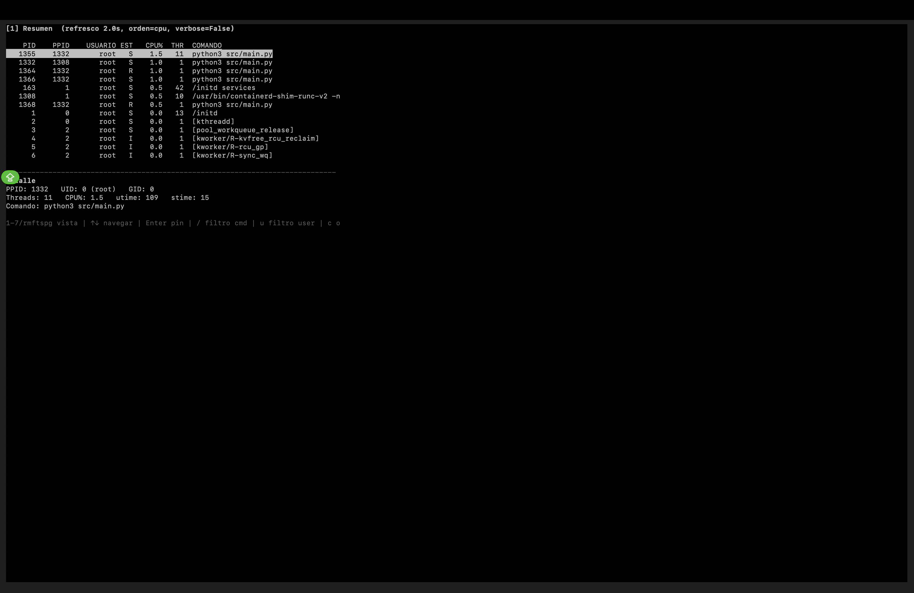

# TP1 — Monitor de Procesos y Threads

**Computación II — Universidad de Mendoza — 2026**

Monitor de procesos en tiempo real estilo `htop`, con foco en mostrar la anatomía interna de cada proceso (memoria, FDs, threads, señales, scheduling) leyendo `/proc` directamente — sin `psutil` ni herramientas equivalentes. Arquitectura multiproceso: un recolector, 7 analizadores independientes y una TUI con curses, todo comunicado con primitivas de `multiprocessing` y coordinado con manejo de señales real (self-pipe).


*Vista Resumen, corriendo de verdad en Docker Desktop sobre macOS (con `pid: host`, mostrando los procesos reales de la VM Linux de Docker).*

---

## Índice

1. [Descripción general](#1-descripción-general)
2. [Diagrama de arquitectura](#2-diagrama-de-arquitectura)
3. [Decisiones de diseño](#3-decisiones-de-diseño)
4. [Conceptos del curso aplicados](#4-conceptos-del-curso-aplicados)
5. [Limitaciones conocidas](#5-limitaciones-conocidas)
6. [Cómo correr y testear](#6-cómo-correr-y-testear)
7. [Decisiones sobre la TUI](#7-decisiones-sobre-la-tui)
8. [Lo que aprendí](#8-lo-que-aprendí)

---

## 1. Descripción general

El monitor muestra 7 vistas alternables de los procesos del sistema (o del host, según cómo se corra — ver sección 5): Resumen, Memoria, File Descriptors, Threads, Señales, Scheduling y Sistema global. Cada vista la alimenta un **proceso independiente** (un "analizador") que lee `/proc` a su propio ritmo y escribe el resultado en una estructura compartida; la interfaz (TUI con `curses`) lee esa estructura y la dibuja, sin bloquear a los analizadores ni viceversa.

Se navega con `1`-`7` o las teclas `r/m/f/t/s/p/g`, se puede pinear un proceso con `Enter`, filtrar por comando (`/`) o usuario (`u`), rotar el orden con `c`, ajustar el intervalo de refresco de la vista activa con `+`/`-`, y salir limpio con `q`. El programa responde además a 5 señales del sistema operativo (`SIGINT`, `SIGTERM`, `SIGHUP`, `SIGUSR1`, `SIGUSR2`) — ver sección 4.

Corre dentro de un contenedor Docker (`docker compose up --build`), pensado para Linux/`linux-amd64`/`linux-arm64`.

## 2. Diagrama de arquitectura

```
┌──────────────┐   pids_compartidos    ┌───────────────────────────────┐
│  recolector   │──(Manager.dict)─────>│         7 analizadores          │
│  (cada 2s)    │                       │      (procesos independientes)  │
└──────────────┘                       │                                  │
                                        │  resumen      (2s,  min 0.5s)   │
                                        │  memoria      (3s,  min 1s)     │
                                        │  fds          (5s,  min 2s)     │
                                        │  threads      (2s,  min 0.5s)   │
                                        │  señales     (10s,  min 5s)     │
                                        │  scheduling  (10s,  min 5s)     │
                                        │  sistema      (2s,  min 1s)  ───┼──┐
                                        └───────────────┬─────────────────┘  │ lee
                                                         │ escriben            │ resumen +
                                                         v                     │ memoria
                                        ┌───────────────────────────────┐    │ (top 3
                                        │      snapshot global           │<───┘  CPU/RSS)
                                        │     (Manager.dict compartido)  │
                                        └───────────────┬─────────────────┘
                                                         │ lee cada frame
                                                         v
  SIGINT/TERM/HUP/USR1/USR2 ──┐          ┌───────────────────────────────┐
  (self-pipe, senales.py)      ├────────>│   main.py: loop principal      │
  teclado (curses, no          │         │   (curses.wrapper + select)    │
  bloqueante) ──────────────────┘         │   TUI: display.py               │
                                          └───────────────────────────────┘
```

Cada analizador es un `multiprocessing.Process` separado; ninguno depende de que otro esté vivo (si uno muere, ver sección 5). El `snapshot` es un único `Manager.dict` donde cada analizador escribe **solo su propia clave** (`"resumen"`, `"memoria"`, etc.) — nunca hay dos procesos escribiendo la misma clave, así que no hace falta un `Lock` explícito para esas escrituras: cada `dict[clave] = valor` ya es una operación atómica a nivel del proxy del `Manager`.

La única excepción es `sistema`, que además **lee** (no escribe) `snapshot["resumen"]` y `snapshot["memoria"]` para armar el top 3 por CPU% y por RSS — sigue siendo seguro por el mismo motivo: solo lee claves ajenas, nunca escribe en ellas.

## 3. Decisiones de diseño

### ¿Por qué `Manager.dict` y no otra cosa?

El `snapshot` necesita guardar estructuras anidadas arbitrarias (listas de diccionarios, con distinta forma según la vista). `multiprocessing.Value` y `Array` solo sirven para tipos compatibles con `ctypes` (enteros, floats, arrays de tamaño fijo) — no pueden guardar una lista de diccionarios Python. Un `Manager.dict()`, en cambio, corre un proceso servidor aparte que serializa (pickle) cualquier objeto Python y lo entrega a quien lo pida, así que puede guardar lo que sea. Es más lento que memoria compartida cruda, pero acá el cuello de botella real es leer `/proc` (syscalls + parsing de texto), no el overhead del `Manager` — no vale la pena la complejidad de memoria compartida manual para esto.

`pids_compartidos` usa el mismo mecanismo por la misma razón: guarda una lista de PIDs (tamaño variable, cambia constantemente).

### ¿Por qué sí `Value` para los intervalos?

Los intervalos de refresco (`intervalos["resumen"]`, etc.) son al revés: un solo número (float) que se lee y escribe muy seguido (cada vuelta del loop del analizador correspondiente, y cada vez que se aprieta `+`/`-`). Para esto, un `multiprocessing.Value("d", ...)` es la herramienta correcta — memoria compartida real vía `ctypes`, sin pasar por el proceso servidor del `Manager`, mucho más liviano para un dato tan simple. Es un ejemplo concreto de elegir la primitiva según la forma del dato, no una sola para todo.

### ¿Por qué `Event` para el shutdown y no otra cosa?

`evento_salida` es un `multiprocessing.Event()`. El shutdown necesita ser **cooperativo**: cada analizador, en su propio loop, espera con `evento_salida.wait(intervalo.value)` en vez de `time.sleep()` — así, cuando el proceso principal llama a `evento_salida.set()`, todos los analizadores despiertan de inmediato (no esperan a que termine su intervalo) y salen del loop en la próxima vuelta. Un `Event` es exactamente la primitiva pensada para "avisarle a varios procesos que algo pasó", sin tener que mandarle un mensaje a cada uno por separado.

### Manejo de señales: patrón self-pipe

Ver `senales.py`. Un signal handler de Python no puede hacer trabajo real de forma segura (tocar el `Manager.dict`, abrir archivos) — la práctica estándar es que el handler solo escriba un byte a un pipe (`os.write` es async-signal-safe) y el loop principal, que espera con `select()` sobre ese pipe además de su timeout normal de refresco, decida qué hacer **fuera** del handler. Las 5 señales (`SIGINT`, `SIGTERM`, `SIGHUP`, `SIGUSR1`, `SIGUSR2`) se manejan así.

### Race conditions y cómo se manejan

`/proc` es una foto de un instante: un PID puede desaparecer entre que el recolector lo lista y que un analizador lo lee. Todas las funciones de `procfs.py` que tocan `/proc/<pid>/...` dejan propagar `FileNotFoundError`/`ProcessLookupError` (y, con `pid: host`, también `PermissionError` para procesos de otros usuarios) — cada analizador las captura por PID individual y sigue con el resto, sin abortar toda la pasada.

Esto no es solo teoría: lo probé de verdad, forzando la race. Con doble fork (para que el proceso quede huérfano y lo cosechara el init del sistema, no yo) y leyendo `/proc/<pid>/stat` mientras el proceso desaparecía de verdad:

```
PID 742: FileNotFoundError -- race condition real, manejada sin crashear
PID 744: info_resumen -> FileNotFoundError -- tambien manejado bien
```

Y un stress test más de fondo: corrí el monitor completo 8 segundos mientras un hilo aparte generaba y mataba procesos (`subprocess.Popen(["true"]).wait()`) sin parar — cero tracebacks, salida limpia.

También probé zombies de verdad (fork + el padre a propósito no llama `wait()`):

```
Estado crudo (stat campo 3): 'Z'
Estado legible: Zombie
zombies totales en el sistema: 1
```

### ¿Por qué esos intervalos por defecto?

Coinciden con los de la consigna, pero la lógica detrás es: las vistas que leen datos "baratos" (un par de campos de `stat`/`status`) y que además cambian rápido (CPU%, estado) refrescan seguido — Resumen y Threads, 2s. Las que son más caras de recorrer (`maps` completo para Memoria, `fd/` completo para FDs) o cambian poco en la práctica (máscaras de señales, scheduling policy) refrescan más lento — Señales y Scheduling, 10s. Sistema global refresca cada 2s porque es liviano (un puñado de archivos de tamaño fijo) y es la vista que uno más quiere ver "en vivo".

## 4. Conceptos del curso aplicados

- **Clase 3 (Procesos, fundamentos)** — la vista Resumen es literalmente la anatomía de un proceso: PID/PPID de `/proc/<pid>/stat`, UID/GID de `status`, estado de `stat` campo 3.
- **Clase 4 (fork, exec, wait — zombies, COW)** — la detección de zombies usa el mismo campo `state` de `/proc/<pid>/stat`: un zombie es un proceso que ya terminó pero cuyo padre todavía no llamó a `wait()` para "cosecharlo" — mientras tanto, el kernel mantiene su entrada en la tabla de procesos con estado `Z`. Lo verifiqué generando un zombie real (ver sección 3).
- **Clase 5 (Pipes)** — el patrón self-pipe de `senales.py` usa `os.pipe()` como el mecanismo de coordinación entre el signal handler y el loop principal.
- **Clase 6 (Señales)** — las 5 señales manejadas (`SIGINT/TERM/HUP/USR1/USR2`), con handlers async-signal-safe (solo `os.write`, nada de trabajo real dentro del handler).
- **Clase 7 (mmap y memoria compartida)** — `Manager.dict` y `multiprocessing.Value` son abstracciones de Python sobre memoria compartida entre procesos; se explica en la sección 3 por qué se usó cada una según la forma del dato.
- **Clase 8 (Multiprocessing, fundamentos)** — la arquitectura entera: 8 procesos (`recolector` + 7 analizadores) corriendo en paralelo, cada uno con su propio ciclo de vida.
- **Clase 9 (Multiprocessing avanzado — `Manager`, `Value`, `Array`)** — uso explícito y diferenciado de `Manager.dict` (snapshot, pids compartidos) y `Value` (intervalos, modo verbose), justificado en la sección 3.
- **Clase 10 (Threading, GIL)** — deliberadamente **no** se usó threading para la arquitectura principal: si los 7 analizadores fueran threads de un mismo proceso, el GIL serializaría el trabajo de cada uno, y un crash de uno (una excepción no capturada) podría tirar abajo el proceso entero. Con procesos separados, cada analizador tiene su propio intérprete y su propio espacio de memoria — un analizador que se cae no afecta a los demás ni al proceso principal. La consigna permite threads solo para la entrada de teclado del display, y ni eso hizo falta: `curses` con `stdscr.timeout()` ya da un polling no bloqueante sin necesitar un thread aparte.

## 5. Limitaciones conocidas

- **En Docker Desktop sobre macOS, `pid: host` muestra los procesos de la VM Linux de Docker Desktop, no los procesos nativos de macOS.** macOS no puede correr contenedores Linux de forma nativa — Docker Desktop siempre levanta una VM Linux liviana por debajo, y es *esa* VM la que comparte su namespace de PIDs con el contenedor. Es una limitación de la plataforma, no del código: en un host Linux real (o en la nube), `pid: host` mostraría los procesos reales del host.
- Con `pid: host`, algunos procesos de otros usuarios no se pueden leer del todo (`PermissionError`) — se ignoran, no rompen nada, pero significa que la vista no es 100% completa para procesos ajenos al usuario del contenedor (que corre como root, así que en la práctica esto afecta a pocos casos).
- La vista **Threads** muestra los threads de **todos los procesos del sistema en una sola tabla plana**, no los threads del proceso actualmente seleccionado en Resumen. Fue una decisión consciente para mantener la arquitectura de "cada analizador es independiente, no depende de qué esté mirando el usuario en la TUI" — la alternativa (un analizador que sepa qué proceso está seleccionado) requeriría un canal de comunicación adicional TUI → analizador que no está pedido por la consigna.
- El orden por RSS (`c` para rotar orden) solo tiene efecto real en la vista Memoria — en las demás vistas, ordenar por `rss` es un no-op silencioso (no hay ese campo en esas filas), no rompe nada pero tampoco hace algo visible.
- `SIGWINCH` (repintar al resizar la terminal) no está implementado — es explícitamente opcional en la consigna.
- Page faults y context switches se muestran **acumulados desde que arrancó el proceso**, no como tasa por segundo — la consigna no pide la tasa y calcularla hubiera sido una decisión de diseño extra no solicitada.

## 6. Cómo correr y testear

Requiere Docker Desktop instalado y corriendo.

```bash
git clone https://github.com/kiki0511/um-computacion2.git
cd um-computacion2/tp1
docker compose up --build
```

> Nota para correrlo interactivo desde una terminal (no en background): agregá `--no-log-prefix --menu=false` — sin eso, Docker Compose le agrega un prefijo de log a cada línea que rompe visualmente la TUI (es un comportamiento de Compose, no un bug del monitor):
> ```bash
> docker compose up --build --no-log-prefix --menu=false
> ```

Dentro del monitor:

| Tecla | Acción |
|---|---|
| `1`-`7` / `r m f t s p g` | Cambiar de vista |
| `↑` `↓` | Navegar |
| `Enter` | Pinear/despinear el proceso seleccionado |
| `/` | Filtrar por comando |
| `u` | Filtrar por usuario |
| `c` | Rotar orden (CPU% / RSS / PID) |
| `+` `-` | Ajustar intervalo de la vista activa |
| `q` | Salir |
| `h` / `?` | Ayuda |

Para probar las señales, desde otra terminal (necesitás el PID del proceso Python *dentro* del contenedor, no del contenedor mismo):

```bash
docker compose exec monitor sh -c "kill -HUP 1"    # recarga config.json
docker compose exec monitor sh -c "kill -USR1 1"   # dump del snapshot
docker compose exec monitor sh -c "kill -USR2 1"   # toggle verbose
```

(El PID 1 dentro del contenedor es el proceso `python3 src/main.py`, porque no hay ningún otro proceso corriendo delante de él en el `CMD` del `Dockerfile`.)

## 7. Decisiones sobre la TUI

Se eligió `curses` (stdlib) sobre `rich`: no agrega dependencias externas (el `requirements.txt` queda vacío), y sobre todo, `curses` da entrada de teclado no bloqueante nativa (`stdscr.timeout(150)`) sin necesitar un thread aparte para leer teclas — encaja mejor con el estilo del TP (tocar las primitivas del sistema operativo directamente) que una librería de alto nivel pensada para otra cosa.

El layout es: encabezado (vista activa, intervalo, orden, filtros activos) → tabla de procesos (con la fila seleccionada resaltada por `curses.A_REVERSE`, y la pineada además en negrita) → panel de detalle de la fila seleccionada → pie con los atajos de teclado. La vista Sistema global rompe ese patrón a propósito (no es una tabla de procesos, es un panel de agregados) — `display.py` la maneja como caso especial.

Toda la lógica de estado (qué tecla hace qué, cómo se filtra/ordena) está separada del código que efectivamente dibuja en pantalla, para poder testearla con Python puro sin necesitar una terminal real — el dibujado en sí se probó corriendo el programa bajo una pty real y decodificando el buffer de pantalla con `pyte` (un emulador de terminal), incluyendo los atributos de celda (para confirmar que el resaltado cae en la fila correcta, no solo que el texto está bien).

## 8. Lo que aprendí

Lo que más me costó entender no fue la sintaxis de multiprocessing, sino la idea de que cada analizador es un proceso completamente aislado, con su propia memoria: al principio me costaba pensar por qué no podía simplemente usar una variable global para compartir datos entre el recolector y los analizadores, y ahí fue cuando entendí para qué sirve realmente un Manager.dict — no es "una forma más prolija" de compartir datos, es la única forma, porque cada proceso vive en su propio espacio de memoria y no hay otra manera de que se vean entre sí sin pasar por algo como esto.
Hubo un bug puntual que me hizo entender algo más de fondo: al principio, cambiar de vista en la TUI (por ejemplo de Resumen a Memoria) hacía explotar el programa con un KeyError. Cuando entendimos que el problema era que la tecla cambiaba la vista pero el programa todavía dibujaba con los datos de la vista anterior (un desfasaje de un solo frame), terminé de entender por qué el orden en que se procesan las cosas dentro de un loop importa tanto — no alcanza con que el código "funcione la mayoría de las veces", tiene que ser correcto en el orden exacto en que pasan las cosas. Algo similar me pasó con Docker Compose rompiendo la interfaz: no era un bug de mi código, sino de cómo Compose mezcla la salida de varios procesos por default — aprendí que cuando algo no anda, no siempre es tu código el problema, a veces es una herramienta de por medio haciendo algo que uno no esperaba.
Si tuviera que rehacerlo, creo que dedicaría más tiempo a testear cada fase antes de avanzar a la siguiente, en vez de encontrar los bugs más grandes recién en fases avanzadas.
